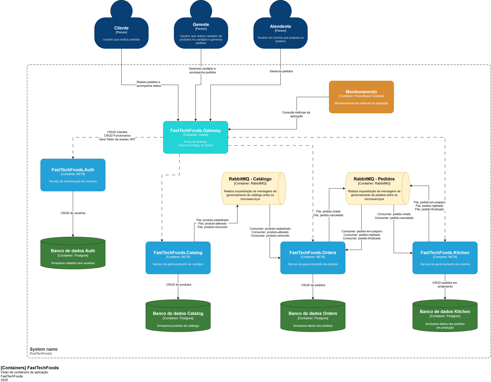
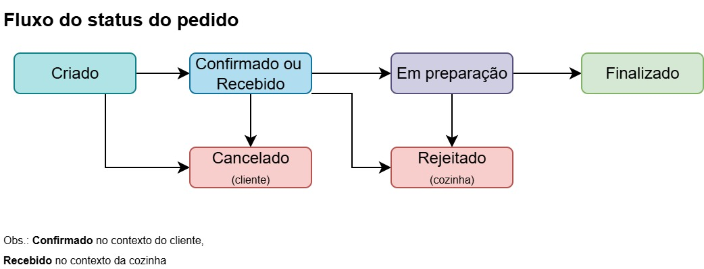

# Fast Tech Foods - Gateway

Este é um micro serviço desenvolvido em .NET Core 8 para gerenciar os endpoints da aplicação Fast Tech Foods. 
Este projeto é parte da solução para o Hackathon da Fase 5 do curso de pós graduação 6NETT na FIAP.

## Índice
- [Pré-requisitos](#pré-requisitos)
- [Overview](#overview)
- [Configuração do Projeto](#configuração-do-projeto)
- [Tecnologias Utilizadas](#tecnologias-utilizadas)

## Pré-requisitos

- [Kubernetes](https://kubernetes.io/pt-br/)
- [Minikube](https://minikube.sigs.k8s.io/docs/start)
- [Docker](https://www.docker.com/get-started/) e [Docker Compose](https://docs.docker.com/compose/install/) (necessário para executar o projeto)
- [.NET SDK 8.0](https://dotnet.microsoft.com/download/dotnet/8.0) (somente para executar local)

## Overview
**Containers**


**Fluxo do Pedido**


## Configuração do Projeto

**1. Clone o repositório:**

   ```bash
   git clone https://github.com/Grupo-1-6NETT/FastTechFoods.Gateway.git
   cd FastTechFoods.Gateway
   ```

**2. Adicione configurações necessárias**

Um arquivo `.env` com as variáveis de ambiente deve ser adicionado na raíz do projeto. 

Já na pasta `~/k8s/shared/postgres` devem ser adicionados os seguintes arquivos:

- postgre-secret.yaml
- rabbitmq-secret.yaml

**3. Suba os pods**

Abra uma janela do PowerShell e, na pasta `~/k8s`, execute o script `runall.ps1`. Note que será necessário permissões elevadas.

Ou se preferir, execute os seguintes comandos. Certifique-se de estar na pasta `k8`:

Note que alguns comandos exigem que a janela do PS permaneça aberta. Pode ser necessário abrir mais de uma janela.

```
minikube start
minikube addons enable ingress

kubectl apply -f .\fasttechfoods-namespace.yaml
kubectl apply -f .\monitoring-namespace.yaml
kubectl apply -f .\auth\ -n fasttechfoods
kubectl apply -f .\catalog\ -n fasttechfoods
kubectl apply -f .\orders\ -n fasttechfoods
kubectl apply -f .\kitchen\ -n fasttechfoods
kubectl apply -f .\shared\ingress\ -n fasttechfoods
kubectl apply -f .\shared\postgres\ -n fasttechfoods
kubectl apply -f .\shared\rabbitmq\ -n fasttechfoods
kubectl apply -f .\shared\monitoring\

minikube tunnel

kubectl port-forward service/rabbitmq 15672:15672 -n fasttechfoods
kubectl port-forward svc/prometheus 9090:9090 -n monitoring
kubectl port-forward svc/grafana 3000:3000 -n monitoring
```

**4. Abra o minikube dashboard**

```
minikube dashboard
```


---
## Tecnologias Utilizadas
- **ASP.NET Core 8** - Framework principal para desenvolvimento do serviço
- **Entity Framework Core** - ORM para manipulação do banco de dados
- **Postgres** - Banco de dados
- **RabbitMQ** - Message Broker
- **MassTransit** - Transporte de mensagens
- **Docker** - Criação de conteiners
- **Kubernets** e **Minikube** - Orquestração de containers
- **Prometheus** e **Grafana** - Monitoramento
